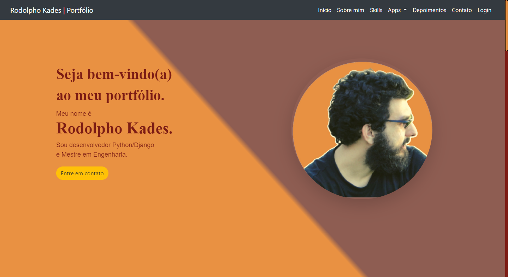
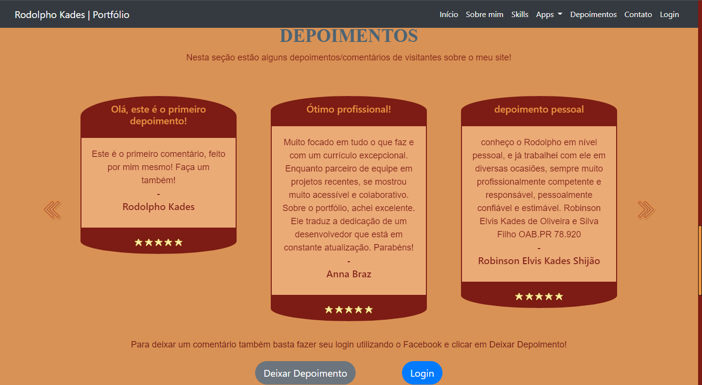
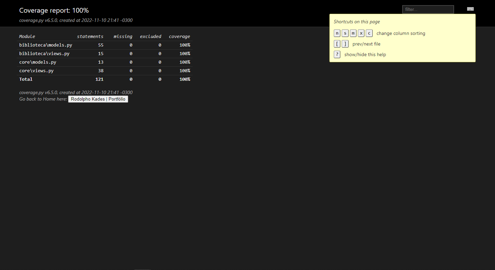

    <h3>
    Welcome to my portfolio! 
    </h3>
    
This is the very first personal Django project I publish, take a look around! :)

    
It is localized for english and spanish, but the images below are in portuguese as it is my native language.

    

        And to see the site: <a href="https://rodskades.pythonanywhere.com/">Rodolpho Kades | Porfólio </a>
    

    <h1>The Index</h1>
    
    
In the homepage you'll see a welcome message followed by a quick story on how I became a developer.

    
    You can also find below that the skills in which I have been specializing myself.

    <h3>The Testimonials Section</h3>
    

    Still in the homepage, you'll find a testimonials section where everyone can leave a comment about what they
    think of my website.
    

    
    
To leave a testimonial, all you have to do is log in using Facebook and click leave a testimonial.

    <h1>The Library</h1>
    

    In the "Apps" dropdown on the navigation bar, you'll find my personal library, where I have stored all the data
    from books I own.
    

    
    

    As you can see, you can click the name of the books to see its cover and further information about it.
    

    <h1>Tests Coverage</h1>
    

    This is a simple auto-generated coverage HTML to show off how I tested every needed aspect of my Django project.
    

    
    
You may navigate through the modules to see how it is implemented and where is it tested.

    
This was generated using the coverage package, which can be installed via pip.

    <h3>Thanks so much for looking around! :)</h3>
    
If you have any questions, fell free to contact me!

REFERENCES:
---------------------------------------
    [1]: https://docs.djangoproject.com/en/4.1/
    [2]: https://pypi.org/project/django-session-timeout/
    [3]: https://getbootstrap.com/docs/5.2/getting-started/introduction/
    [4]: https://docs.djangoproject.com/en/4.1/topics/db/sql/
    [5]: https://django-bootstrap4.readthedocs.io/en/latest/templatetags.html#bootstrap-field
    [6]: https://docs.djangoproject.com/en/2.1/topics/class-based-views/generic-editing/#models-and-request-user
    [7]: https://docs.djangoproject.com/en/4.1/ref/contrib/auth/
    [8]: https://www.30secondsofcode.org/css/s/hover-underline-animation

CONTACT:
---------------------------------------
[LinkedIn](https://www.linkedin.com/in/rodolpho-kades/)

[GitHub](https://github.com/rodskades)

<rodolpho_kades@hotmail.com>